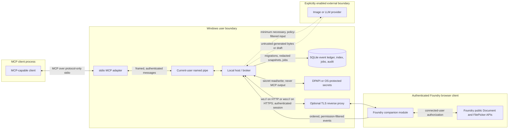

# Architecture and threat model

This document describes the security architecture required by the product contract. It is not, by itself, evidence that every component or control is complete. The implementation and live-validation status is recorded in [validation-matrix.md](./validation-matrix.md).

## Scope and security posture

Foundry MCP lets an MCP client ask a paired Foundry client to inspect or change content through Foundry's public APIs. “Any object” means visible Foundry Documents, not JavaScript objects, browser globals, the Windows filesystem, the Foundry database, or container internals. “Any image” means assets exposed by authorized Foundry FilePicker sources and image references in visible Documents.

The default posture is:

- local-only transport and processing;
- read-only until a user grants a narrow mutation scope;
- no implicit world selection when more than one eligible world is connected;
- no external image or language-model provider until explicitly enabled;
- no autonomous Foundry mutations from background analysis;
- no destructive operation without a separate opt-in and confirmation flow; and
- no bypass of Foundry permissions, licensing, package protections, or source-provider rules.

## Components

| Component         | Responsibility                                                                                      | Data it must not own                                                                |
| ----------------- | --------------------------------------------------------------------------------------------------- | ----------------------------------------------------------------------------------- |
| MCP client        | Sends MCP requests and displays structured results                                                  | Pairing/provider secrets and unrestricted Foundry state                             |
| stdio adapter     | Implements the MCP wire protocol and forwards bounded broker requests                               | Foundry credentials, policy decisions, and durable world state                      |
| local host/broker | Owns policy, connection selection, audit, SQLite state, jobs, redaction, and provider credentials   | Direct access to the Foundry world database or Docker socket                        |
| companion module  | Runs in an authenticated Foundry client and calls public Foundry APIs under that user's permissions | Provider credentials, arbitrary host files, and authority beyond the connected user |
| protocol package  | Defines versioned, validated request, response, event, and error envelopes                          | Runtime secrets or environment-specific policy                                      |
| SQLite store      | Persists migrations, event ledger, bounded indexes, jobs, and audit records                         | Raw secrets and content excluded by retention/redaction policy                      |
| optional provider | Generates an image or cited draft after explicit opt-in                                             | Pairing credentials, unrelated world content, or direct Foundry write access        |

The Foundry module is browser-side code served by Foundry. A Docker-hosted Foundry server does not need access to the Windows named pipe, local SQLite file, or MCP stdio process.

Capability data stays behind the narrowest applicable API boundary:

| Capability                                            | Authoritative operation boundary                                                                                                        |
| ----------------------------------------------------- | --------------------------------------------------------------------------------------------------------------------------------------- |
| Root, embedded, Actor, Item, and compendium Documents | Runtime-registered Foundry Document collections, UUID resolution, and generic create/update APIs under the connected user's permissions |
| Images and writable assets                            | Foundry FilePicker browse/upload sources and paths that report write permission; never an arbitrary Windows/container path              |
| Journal sessions                                      | Real JournalEntry and JournalEntryPage Documents with module-owned flags/pages; unrelated user pages are not overwritten                |
| Background intelligence                               | Host SQLite ledger/index and optional cited drafts; suggestions cannot call Foundry APIs by themselves                                  |

The MCP wire revision negotiated between client and adapter is independent from the private bridge revision shared by adapter, host, protocol package, and module. Compatibility output must report them separately; accepting an MCP legacy revision does not downgrade or imply compatibility with a different bridge envelope.

## Data flow

`RP` may be a direct loopback WebSocket listener for an HTTP Foundry page; TLS termination is required when an HTTPS Foundry page connects to the broker. The exact configured Foundry origin must be allowlisted. Wildcards are not an acceptable substitute.

## Request lifecycle

1. The MCP client negotiates the MCP wire revision with the stdio adapter.
2. The adapter validates the tool input and sends a request with a request ID, deadline, and correlation ID over the current-user broker transport.
3. The host authenticates the transport, applies policy, and resolves the requested connection. If several worlds are eligible, the request must identify one explicitly.
4. The module validates the authenticated bridge envelope and re-authorizes the operation against the active Foundry user and the current Document/FilePicker state.
5. Foundry executes the operation through a public API. Live objects are converted to bounded JSON-safe data before leaving the module.
6. The response follows the same authenticated path back. The host records a redacted audit event; stdio stdout remains MCP-only.

An idempotency key prevents a retry from repeating a committed side effect. It does not replace authentication, authorization, or an optimistic update precondition.

## Event and intelligence lifecycle

The module emits ordered, permission-aware event envelopes. The host acknowledges sequence IDs, suppresses duplicates, and appends accepted events to SQLite. Local search, timelines, relationship extraction, and bounded context packs do not require an external provider.

Provider analysis is a separate opt-in step. Input is filtered for visibility, private-page/chat rules, configured redactions, and retention policy. Provider output is stored as a cited draft with provenance. Applying a suggestion to Foundry requires a later, explicit MCP mutation call and normal authorization.

## Trust boundaries and invariants

- The MCP client is not trusted to choose its own authorization scope.
- Campaign text, filenames, image metadata, provider output, and module-socket data are untrusted inputs.
- The adapter and host run as the current desktop user, not as administrator or a Windows service.
- The named pipe must fail closed unless its ACL and the peer's user/logon identity match the current user. Message authentication is defense in depth, not an ACL replacement.
- The browser origin is distinct from the bridge endpoint. Both must be validated.
- The module is the final authorization point because it has the live Foundry user and Document state.
- Secrets stay in the local host's protected store. They do not belong in MCP client JSON, logs, SQLite content rows, module messages, or repository files.
- A Docker bind mount is deployment plumbing, not an authorization bypass. Installation tooling may write only its owned module files inside an explicit User Data path.

## Threat model

The controls below are requirements. Consult the validation matrix before treating a control as implemented or live-tested.

| Threat                                    | Attack path and impact                                                                                                 | Required controls                                                                                                                                                                                                                                                                         | Residual risk / verification                                                                                   |
| ----------------------------------------- | ---------------------------------------------------------------------------------------------------------------------- | ----------------------------------------------------------------------------------------------------------------------------------------------------------------------------------------------------------------------------------------------------------------------------------------- | -------------------------------------------------------------------------------------------------------------- |
| DNS rebinding and hostile Host headers    | A browser is induced to address a loopback broker through an attacker-controlled hostname.                             | Bind loopback by default; validate Host and exact Origin; authenticate every session; never trust DNS resolution alone; refuse wildcard allowlists.                                                                                                                                       | Exercise Host/Origin changes and rebinding-style requests against the real listener.                           |
| CSRF and Origin confusion                 | A hostile page opens the broker or reuses an authenticated browser context.                                            | Exact scheme/host/port allowlist; credential-free bridge URLs; nonce-based pairing; SameSite/CSRF protections if HTTP endpoints exist; no authorization based only on Origin.                                                                                                             | Browser behavior and reverse-proxy header handling need live tests.                                            |
| Named-pipe cross-user access              | Another local account or logon session connects to the adapter/host pipe.                                              | Current-user and logon-SID ACL; peer-token verification; fail-closed readiness; authenticated frames; no predictable secret as the only control.                                                                                                                                          | Validate on Windows with a genuinely different account/logon session.                                          |
| Pairing-token theft or replay             | A copied token or captured bridge frame is reused or self-asserts another connection identity.                         | Cryptographically random secret; DPAPI/OS storage; one-time display and rotation; nonce, timestamp/sequence, expiry, world/origin binding; encrypted connection-scoped identity credential; constant-time verification; duplicate rejection; new identity enrollment clears prior grants. | A compromised current user can still access that user's data; rotation and incident guidance remain necessary. |
| Prompt injection in campaign content      | A Journal, chat message, Actor field, or filename tells the model to widen scope, reveal secrets, or mutate the world. | Keep policy outside model context; label content as untrusted; schema-bound tools; explicit user authorization; provider routing and redaction cannot be changed by content; background analysis produces suggestions only.                                                               | Model output remains untrusted even after filtering.                                                           |
| SSRF in URL import or providers           | A URL targets loopback, link-local, RFC1918, cloud metadata, or a redirected private host.                             | Disable URL import by default; reject credentials; resolve and re-check every redirect; block private/special-use destinations; enforce protocol, DNS, timeout, redirect, and byte limits.                                                                                                | DNS races require connect-time address enforcement, not a single preflight lookup.                             |
| Path traversal and unsafe removal         | `..`, absolute paths, links/junctions, or crafted manifests escape the configured asset/module root.                   | Use Foundry FilePicker for assets; canonicalize and contain paths; use literal paths; reject rooted/traversal destinations; ownership manifest plus hash checks; refuse unrecognized recursive deletion.                                                                                  | Reparse-point/junction behavior needs platform-specific adversarial tests.                                     |
| Zip/decompression bombs                   | A small archive expands to excessive bytes/files/depth or exhausts disk/memory.                                        | Bound compressed and expanded bytes, entry count, path depth, and ratio; reject traversal and nested archives; extract to a contained temporary directory; clean up safely.                                                                                                               | The Windows installer must be tested with adversarial archives before release.                                 |
| Malicious SVG or image polyglots          | Active SVG, mismatched MIME, huge dimensions, or decoder exploits reach Foundry or a client.                           | MIME sniff; decode before upload; byte/pixel/dimension limits; reject or safely rasterize SVG; normalize extension; treat provider output as untrusted.                                                                                                                                   | Image decoders and rasterizers remain supply-chain attack surfaces.                                            |
| Private-content leakage                   | Hidden Documents, secret Journal blocks, whispers, provider keys, or unrelated world data enter MCP/provider output.   | Authorize in the module; preserve page-level secrecy; private chat capture off; provider opt-in; minimum necessary fields; redaction and retention; bounded audit without secret values.                                                                                                  | Permission fixtures cannot replace a live system/module privacy review.                                        |
| Malicious module-socket messages          | A client sends oversized, malformed, wrong-world, out-of-order, or privilege-escalating envelopes.                     | Authenticate session and every envelope; strict versioned schemas; size/rate/deadline limits; request and sequence IDs; connection/world binding; reject unknown methods and capabilities; re-authorize in Foundry.                                                                       | Browser extensions or a compromised Foundry page share the user's security context.                            |
| Wrong-world targeting                     | An implicit request reaches a different connected campaign.                                                            | Require an explicit connection/world selector whenever selection is ambiguous; bind capabilities and session identity to world ID; include target in audit output.                                                                                                                        | Human-readable world titles are not stable identifiers.                                                        |
| Unauthorized or destructive writes        | A non-GM or read-only connection creates, updates, or deletes content.                                                 | Read-only default; scoped grants; Foundry permission check at execution time; optimistic version/hash for updates; delete disabled unless separately enabled with dry-run and short-lived confirmation.                                                                                   | A legitimate GM can still make harmful choices; backups remain essential.                                      |
| Provider compromise or cost abuse         | A provider key is exposed, prompts are exfiltrated, or repeated requests incur charges.                                | Host-only secret storage; provider disabled by default; allowlisted provider/config; rate and budget controls; idempotency; provenance/cost metadata; never log keys or sensitive prompts by default.                                                                                     | External providers have their own retention and availability policies.                                         |
| Arbitrary file or licensed-content access | A request reads the host filesystem, Foundry database, protected packages, or container volumes directly.              | Limit objects to public Foundry APIs and visible FilePicker sources; no Docker socket/database integration; no heap/DOM/global enumeration; respect package and source-provider permissions.                                                                                              | Foundry itself and installed modules remain trusted dependencies of the GM.                                    |
| stdio protocol corruption                 | Logs or secrets written to stdout break MCP framing or leak into the client.                                           | Protocol-only stdout; diagnostics to stderr/files; structured redaction; child-process conformance tests; graceful close.                                                                                                                                                                 | Native dependency crashes may still truncate a response.                                                       |
| Resource exhaustion                       | Recursive enumeration, huge snapshots, event floods, or slow providers consume memory or context.                      | Cursor pagination; depth/item/byte limits; deadlines; cancellation; backpressure; event coalescing; bounded queues and retention.                                                                                                                                                         | Limits require load tests with realistic worlds.                                                               |
| Supply-chain or module-package tampering  | A modified module ZIP or dependency runs with the GM's browser privileges.                                             | Versioned artifact, package-content review, integrity/signature guidance, pinned dependencies, no bundled Foundry image or credentials, and reproducible release checks.                                                                                                                  | This repository does not make third-party Foundry images trustworthy.                                          |

## Failure behavior

Failures must be explicit and structured: offline bridge, ambiguous connection, unsupported type, invalid data, permission denied, not found, optimistic conflict, timeout/cancellation, or Foundry-side failure. Provider failure must not stop local ingestion. Reconnect must reconcile bounded state before claiming the index is current. A cancellation that arrives after a side effect commits must report that fact rather than claiming rollback.

## Evidence boundary

Automated fake-runtime and protocol tests can prove schema handling, policy decisions, replay/idempotency behavior, and deterministic Foundry-like flows. They cannot prove that a module loads in Foundry v14, that a licensed Docker image is configured correctly, that a browser accepts a certificate, or that a game system's live permissions behave as fixtures predict. Those are separate manual evidence rows in [validation-matrix.md](./validation-matrix.md).
